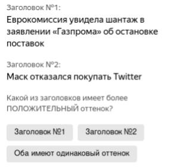
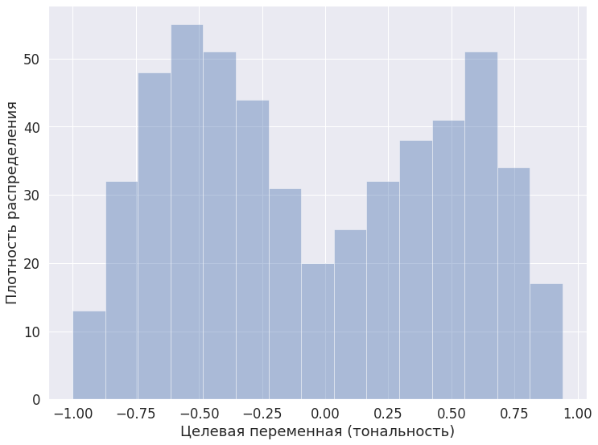

# Financial News Sentiment Dataset (FNS Dataset)

Набор данных Financial News Sentiment Dataset (FNS Dataset) содержит в себе заголовки финансовых новостей о компаниях, торгующихся на Московской и СПб биржах. Целевой переменной датасета является оценка тональности новостных заголовков в виде вещественного числа. В наборе данных присутствуют дополнительные переменные, которые описывают контекст новостного заголовка, например: ссылка на источник, дата публикации, тикеры компаний и т.д. Набор данных может быть использован для анализа тональности новостных заголовков для поддержки принятия решений в области финансовой индустрии, трейдинга и инвестиций. Пример набора данных (за исключением столбцов `link` и	`summary`):

| title                                                                                               | score          | published                       | tickers  |
|-----------------------------------------------------------------------------------------------------|----------------|---------------------------------|----------|
| Электромобильный стартап Arrival экс-главы Yota уйдет из России                                     |  -0.5833333333 | Thu, 12 May 2022 05:10:01 +0300 | ['ARVL'] |
| Шрёдер отклонил предложение войти в совет директоров «Газпрома»                                     |  -0.3333333333 | Tue, 24 May 2022 22:12:05 +0300 | ['GAZP'] |
| Шельф берут в разработку // Генподрядчиком «Газпрома» на море может стать компания Андрея Патрушева |            0.7 | Fri, 29 Jul 2022 00:28:00 +0300 | ['GAZP'] |
| Чистая прибыль "РусГидро" по РСБУ за 1 полугодие выросла на 17%                                     |   0.6818181818 | Thu, 28 Jul 2022 19:06:29 +0300 | ['HYDR'] |
| Финский производитель шин Nokian Tyres решил уйти из России                                         |  -0.4117647059 | Tue, 28 Jun 2022 18:17:06 +0300 | ['NOK']  |
| Федун ушел с поста вице-президента ЛУКОЙЛа на пенсию                                                | -0.02564102564 | Mon, 27 Jun 2022 17:19:50 +0300 | ['LKOH'] |

## Процесс сбора данных

Сбор новостей проводился из RSS-лент следующих источников: [РБК](http://static.feed.rbc.ru/rbc/logical/footer/news.rss), [Коммерсант](https://www.kommersant.ru/RSS/main.xml), [Финам](https://www.finam.ru/analysis/conews/rsspoint), [Investing](https://ru.investing.com/rss/news.rss), и [Ведомости](https://www.vedomosti.ru/rss/news).
Для каждой новости автоматически проверялось наличие наименования определённой компании в заголовке. Например, в заголовке `Тиньков решил уйти на пенсию после продажи доли в TCS Group` имеется упоминание `TCS Group` -- держателя акций банка Тинькофф. Новости, без упоминания компаний не были включены в датасет. После чего, было сформировано задание по типу краудсорсинга для разметки заголовков.

## Процесс разметки заголовков

Разметка заголовков происходила с помощью краудсорсинговой платформы [Яндекс Толока](https://toloka.ai/). Разметчику предлагалось выполнить 10 заданий, в каждом из которых необходимо выбрать, какой из двух новостных заголовков имеет более положительную тональност (см. рисункое ниже).



В общем пуле задач каждому заголовоку случайным образом подбиралось 8 пар для сравнения (второй заголовок). Таким образом, на основе 532 новостных заголовков было сформировано 4256 заданий для краудсорсинга. С помощью интерфейса Толоки перекрытие заданий было задано равным 3. Таким образом, каждый заголовок размечался 24 раза (8*3). Аудитория разметчиков была ограничена по следующим параметрам:

* Языки: Русский (как минимум);
* Образование: Высшее или среднее специальное;
* Дата рождения: старше 01.01.2000.

В дополнение к этому, было выбрано топ 30% разметчиков по качеству. Автоматический контроль качества проводился посредством блокировки разметчиков, слишком быстро выполняющих задание (менее 25 секунд) и неправильно вводивших капчу (менее 70% правильных ответов).

## Подсчёт целевой переменной

Целевая переменная (тональность заголовка) была подсчитана следующим образом: T = n<sub>positive</sub>/n<sub>total</sub> - n<sub>negative</sub>/n<sub>total</sub>.

Где n<sub>positive</sub> - количество раз, когда заголовок был размечен как более положительный, n<sub>total</sub> - общее количество разметок, n<sub>negative</sub> - количество раз, когда заголовок был размечен как более отрицательный. Распределение значений целевой переменной доступно на рисунке ниже.



## Надёжность результатов разметки

Надёжность результатов разметки была подсчитана следующим образом. 

Первый критерий -- расчёт показатель [Fleiss' Kappa](https://en.wikipedia.org/wiki/Fleiss%27_kappa), который равен `0.2639`, что соответствует достаточной согласованности разметчиков (англ. fair agreement).

Второй критерий -- расчёт коррелляции оценок с помощью метода [Split-half reliability](https://www.statology.org/split-half-reliability/), корелляция равна `0.8451`, что означает высокую корелляцию в ответах разметчиков из случайно отобранных групп.

## Идеи для использования датасета

* Создание трейдинговых стратегий на основе анализа тональности новостей "на лету";
* Анализ новостного фона в разрезе времени (день/неделя) или в разрезе компании.

## Пример построения простейшей модели

```python
from sklearn.linear_model import LinearRegression
from sklearn.feature_extraction.text import TfidfVectorizer
from sklearn.metrics import mean_squared_error
from sklearn.model_selection import train_test_split
import pandas as pd

df = pd.read_csv("../data/data.tsv", sep='\t')

train, test = train_test_split(df, test_size=0.3, random_state=42)

vectorizer = TfidfVectorizer()
vectorizer.fit(df['title'])

model = LinearRegression()
model.fit(vectorizer.transform(train['title']), train['score'])

print(mean_squared_error(test['score'], model.predict(vectorizer.transform(test['title']))))
>>> 0.23952362826629248

print(model.predict(vectorizer.transform(["Яндекс увеличил прибыль на $1 млрд"])))
>>> [0.52505851]
```

## Правила использования (лицензия)

[](https://creativecommons.org/licenses/by-nc-sa/4.0/)

Использование датасета разрешено только в исследовательских целях. При использовании, обязательно упоминание источника (подробнее см. [лицензию](https://github.com/WebOfRussia/financial-news-sentiment/blob/main/LICENCE)).

Использование в коммерческих целях только по предварительному согласованию с автором.
